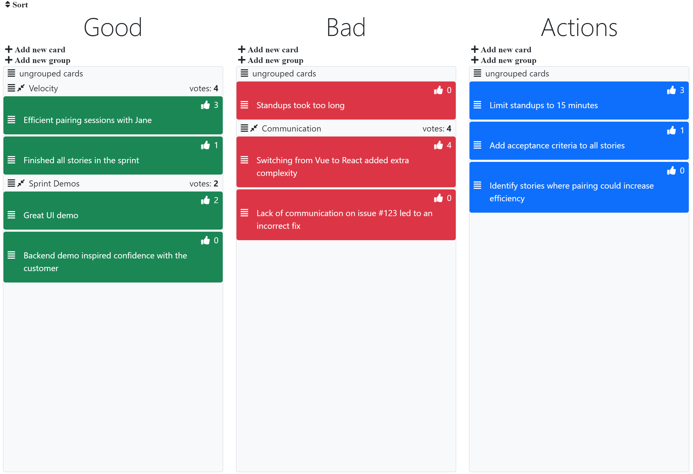

# This repo is under heavy development, not fully functional

# What is this?
* A simple, opinionated, free tool to run retrospectives for a team
* [Easily self-hostable](#Self-Host) or accessible via `retrosimply.com`
> Note: this project is under development, so for now your data will not
persist indefinitely on `retrosimply.com`

# Usage
* Create a room with a password
* Team members join the room, using the same password

# Features
* 3 columns (Good, Bad, Actions)
* Create retro cards, group them, and vote on them
* Unlimited room size

# Demo

# Contributing
## How it works
* A frontend written in `Vue` that communicates with an API written in `Go`
* When a client joins a room, a websocket connection is established and changes
  are broadcast to other clients in the room
* Persistent data is stored in `Redis` with append-only mode on
* Messages are broadcast to other clients via `Redis`' pub sub message broker
* HTTPS is handled via `Caddy` / `Let's Encrypt`
* Auth is handled using JWTs stored as HTTP-only cookies
* Services are orchestrated via `docker-compose`

## Developing
* To make code changes, open the project in the `VSCode` dev container
* In `.env`, set the `DEV_HOST_PATH` path environment variable to the full path
  of the root of the repo on the host machine, such as
  `/home/<host_username>/retro-simply`.

### Quickstart
* After following the steps above, run: `make`, which will run all the production
  services locally. Access them at `https://localhost`
* When finished, run: `make prod-down-volumes` to teardown the services and volumes

### Helpful commands
* To build, test, and then run with frontend hot reloading: `make dev-up`
* To build, test, and then run all services in production mode: `make prod-up`
* To build and test dev images: `make dev-build`
* To build and test prod images: `make prod-build` 
* To test without building Docker images: `make test`
* To test the frontend without building Docker images: `make frontend-test`
* To test the backend without building Docker images: `make backend-test`
* To teardown dev services: `make dev-down`
* To teardown prod services: `make prod-down`
* To teardown dev services and volumes: `make dev-down-volumes`
* To teardown prod services and volumes: `make prod-down-volumes`
* To remove compiled the frontend: `make clean`
* To generate increasing, realistic load: `make load`
* To access retro-simply, navigate to `https://localhost/`
> NOTE: the `make` commands call docker, which calls the host docker daemon.
> To run any docker commands yourself, remember to place `sudo` in front, as
> in `sudo docker ps`.

# Self-Host
* Create a VM with port 80 and 443 open
* Clone the repo
* Change the `DOMAIN` environment variable to your domain(s)
    * For example, if you have an A record for `retrosimply.com -> ip address`
    and a CNAME record for `www.retrosimply.com -> retrosimply.com`, set
    `DOMAIN="retrosimply.com, www.retrosimply.com"`
* Change all `replaceme` values with passwords of your choosing
* Install `docker`, `docker-compose`, and `cmake`
* Find the hard limit number of files: `ulimit -Hn` and set the soft limit
  to that number: `ulimit -n <NUMBER>`
* Run `make prod-up`